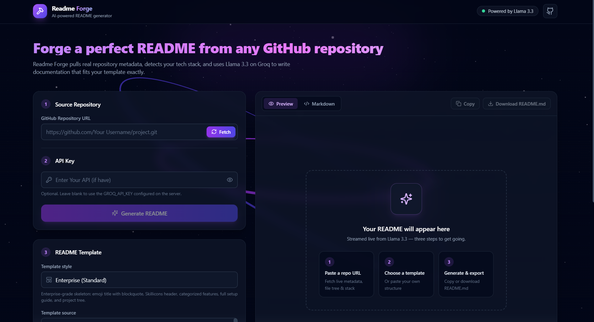

# 🚀 Readme-Forge - Enterprise Platform
> **An AI-powered README.md generator built with Next.js and OpenRouter, converting GitHub repository URLs into polished documentation using custom templates.**

<p align="center">
  
  
  
  
</p>

---

## 🌟 Overview

**Readme-Forge** is a high-performance platform designed to streamline the process of generating high-quality README.md files for GitHub repositories. By leveraging the power of AI and modern web technologies, Readme-Forge aims to simplify the documentation process, making it easier for developers to focus on their projects.





### Why Readme-Forge?

* **Unified Workspace:** Readme-Forge streamlines the process of generating README.md files, providing a unified workspace for developers to manage their project documentation.
* **Modern Stack:** Built on modern infrastructure and clean architectural principles, Readme-Forge ensures a scalable and maintainable solution for generating high-quality README.md files.
* **Automated Data Flow:** Readme-Forge handles complex background logic and real-time processing seamlessly, allowing developers to generate polished documentation with minimal effort.

Readme-Forge is designed to simplify the documentation process, making it easier for developers to create high-quality README.md files. By providing a unified workspace and automating the data flow, Readme-Forge saves developers time and effort, allowing them to focus on their projects.

The platform's architecture is built on modern infrastructure and clean architectural principles, ensuring a scalable and maintainable solution. This enables Readme-Forge to handle complex background logic and real-time processing seamlessly, providing a smooth and efficient experience for developers.

In addition to its technical capabilities, Readme-Forge is also designed to be user-friendly and intuitive. The platform provides a simple and easy-to-use interface, making it easy for developers to generate high-quality README.md files, even for those who are not familiar with documentation best practices.

---

## ✨ Features

### 🎯 Core Features
* **Environment Config Template:** Readme-Forge provides an environment config template, making it easy for developers to configure their project settings.
* **AI-Powered README.md Generation:** Readme-Forge uses AI to generate high-quality README.md files, saving developers time and effort.

### 🔧 Technical Highlights
* **Next.js and OpenRouter Integration:** Readme-Forge is built with Next.js and OpenRouter, providing a powerful and scalable solution for generating README.md files.
* **Custom Templates:** Readme-Forge allows developers to use custom templates, providing flexibility and control over the documentation process.

---

## 🛠 Technologies Used

* Node.js
* TypeScript
* React
* Next.js
* Tailwind CSS
* OpenRouter API

---

## 📦 Installation

Clone the repository:
```bash
git clone https://github.com/DarkFeed2005/Readme-Forge.git
cd Readme-Forge
```

Install dependencies:
```bash
pnpm install
```

---

## 🚀 Usage

Start the development server:
```bash
pnpm dev
```

---

## 📁 Project Structure

```
┌─────────────────┐    fetch(/api/github)     ┌──────────────────┐
│   Next.js Web    │ ────────────────────────► │  /api/github      │
│  (React + Tailwind)│                         │  (proxies GitHub   │
│  dual-pane UI     │                          │   REST API, parses │
└────────┬─────────┘                          │   owner/repo, tree,│
         │                                    │   manifests, tech   │
         │  streaming text (no DB)            │   detection)        │
         ▼                                    └─────────┬────────┘
┌─────────────────┐                          ┌───────────▼────────┐
│   ReadmePreview  │ ◄── STREAM ─────────────│  /api/generate     │
│  (react-markdown │                          │  (OpenRouter,      │
│   + remark-gfm)  │                          │   GPT-OSS 120B,    │
└─────────────────┘                          │   streaming)        │
                                              └───────────────────┘
```

When you submit a repository URL, `/api/github` proxies the GitHub REST API (metadata, recursive file tree, key file contents) and detects the tech stack, then `/api/generate` hands that context plus your template to Llama 3.3 70B via OpenRouter and streams the completion back to the browser for a live preview.

## 🛠️ Tech Stack
**Frontend**
- [Next.js](https://nextjs.org/) (TypeScript, App Router)
- Tailwind CSS + [Lucide React](https://lucide.dev/) icons

**AI Generation**
- [OpenRouter](https://openrouter.ai/) — [Llama 3.3 70B Instruct](https://openrouter.ai/meta-llama/llama-3.3-70b-instruct) (`meta-llama/llama-3.3-70b-instruct`), streamed server-sent response

**Markdown Rendering**
- [react-markdown](https://github.com/remarkjs/react-markdown) + [remark-gfm](https://github.com/remarkjs/remark-gfm)

## 📦 Installation
To install Readme-Forge, follow these steps:
1. Clone the repository:
   ```bash
   git clone https://github.com/DarkFeed2005/Readme-Forge.git
   cd Readme-Forge
   ```
2. Install dependencies:
   ```bash
   npm install
   ```
3. Configure the environment:
   ```bash
   cp .env.example .env.local   # add your OPENROUTER_API_KEY (https://openrouter.ai/keys)
   ```
4. Start the application:
   ```bash
   npm run dev
   ```
   The app is available at `http://localhost:3000`.

## 🚀 Usage
1. Paste a public GitHub repository URL (e.g. `https://github.com/owner/repo`) — or paste it directly into the **README Template** section of the dashboard.
2. Click **Fetch** — metadata, file tree, and manifest contents are pulled from the GitHub API.
3. Pick or paste your template (a default clean template is included; custom structures with `{{placeholders}}` are supported).
4. Optionally override the OpenRouter API key (it falls back to the server-side `OPENROUTER_API_KEY`).
5. Click **Generate README** — the result streams in live on the right; use **Copy** or **Download README.md** when it's done.

## 📁 Project Structure
```
Readme-Forge/
>>>>>>> Stashed changes
├── .env.example
├── .gitignore
├── LICENSE
├── README.md
├── next.config.mjs
<<<<<<< Updated upstream
├── package-lock.json
=======
>>>>>>> Stashed changes
├── package.json
├── postcss.config.mjs
├── src
│   ├── app
│   │   ├── api
<<<<<<< Updated upstream
│   │   │   ├── generate
│   │   │   │   └── route.ts
│   │   │   ├── github
│   │   │   │   └── route.ts
│   │   ├── globals.css
│   │   ├── icon.svg
│   │   ├── layout.tsx
│   │   └── page.tsx
=======
│   │   │   ├── generate/           # OpenRouter streaming route (Llama 3.3 70B)
│   │   │   └── github/             # GitHub metadata, tree, manifest fetcher
│   │   ├── globals.css
│   │   ├── icon.svg
│   │   ├── layout.tsx
│   │   └── page.tsx                # unified state management
>>>>>>> Stashed changes
│   ├── components
│   │   ├── Navbar.tsx
│   │   ├── ReadmePreview.tsx
│   │   ├── RepoForm.tsx
│   │   └── TemplateEditor.tsx
│   ├── lib
│   │   ├── github.ts
│   │   ├── templates.ts
│   │   └── types.ts
├── tailwind.config.ts
└── tsconfig.json
```

---


## 🔐 Security Model
- **Server-side key custody**: the OpenRouter API key lives in `.env.local`, which is gitignored and never committed. The client never sees the server key.
- **Optional client key override**: if supplied, it is sent only to your own server and used exclusively for that generation request — never stored or logged.
- **No persistence**: repository metadata and generated READMEs exist only in page memory for the session; nothing is written to disk or stored server-side.
- **Public data only**: `/api/github` fetches only the public GitHub REST API and only repositories you provide a URL for.

## 🗺️ Roadmap
- **Improve AI-powered README.md generation**: Continue to improve the quality of the generated README.md files.
- **Add more custom templates**: Provide more custom templates for users to choose from.
- **Improve user interface**: Improve the user interface to make it more user-friendly.

## 🤝 Contributing

1. Fork the Project
2. Create your Feature Branch (`git checkout -b feature/AmazingFeature`)
3. Commit your Changes (`git commit -m 'Add some AmazingFeature'`)
4. Push to the Branch (`git push origin feature/AmazingFeature`)
5. Open a Pull Request

## 📄 License
Readme-Forge is licensed under the MIT License. See `LICENSE` for details.
[](https://opensource.org/licenses/MIT)
[](https://www.typescriptlang.org/)
[](https://github.com/DarkFeed2005/Readme-Forge/stargazers)
[](https://github.com/DarkFeed2005/Readme-Forge/network/members)


## 👨‍💻 Author
**Kalana Yasassri**

<p>
  <a href="https://github.com/darkfeed2005" target="_blank" rel="noreferrer"></a>&nbsp;
  <a href="https://www.linkedin.com/in/kalana-yasassri-684591251/" target="_blank" rel="noreferrer"></a>&nbsp;
  <a href="https://www.instagram.com/kalana_yasassri" target="_blank" rel="noreferrer"></a>
</p>

